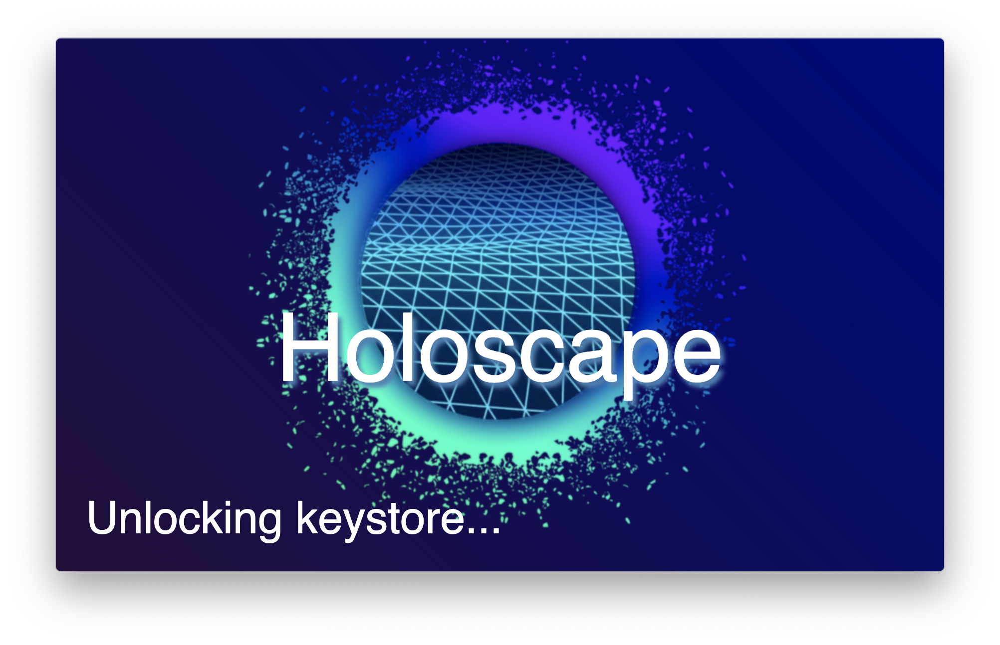
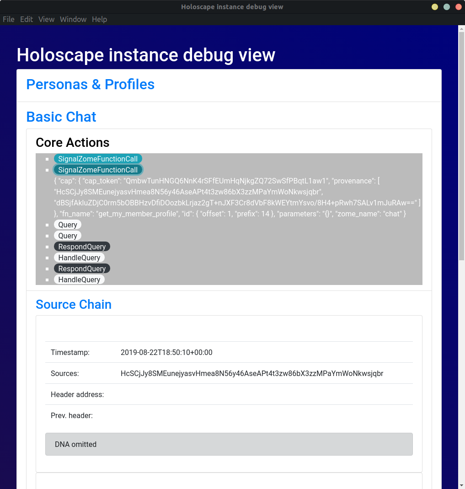

# Holoscape

[](http://holochain.org/)
[](https://chat.holochain.org)

[](https://twitter.com/holochain)

A complete end-user deployment of a Holochain conductor with UI for administration and a run-time for hApp UIs.




## Why?

Holoscape makes using hApps a piece of cake.

As a hApp user:
* You install Holoscape which comes with all the Holochain binaries and sets up and maintains your Holochain conductor config (so you don't neede to know what that even means)
* It runs in the background with a system tray icon to access all configuration dialogs
* You install hApps through [hApp Bundles](example-bundles) with just a few clicks
* You open hApp UIs through the system tray menu
* DNA instances keep running in the conductor even when you close a hApp UI

As a hApp developer:
* Getting your hApp deployed has become **a lot easier**
* You have your user install Holoscape
* You put all your DNAs and UIs into a [hApp bundle](example-bundles)
* You share the hApp bundle with your users

But there is more...
During development of your hApp and DNAs, it would be nice to see what actually is going on in your DNA's source chain and which entries are held in the DHT.

Holoscape as a debug view that shows state dumps and all Holochain core redux actions:

(*so it doubles as a holoscope...*)

## Setup for development

Holoscape needs both binaries ouf the [holochain-rust](https://github.com/holochain/holochain-rust) repository: `hc` and `holochain`.

Depending on the OS, it expects to find either `hc-linux` and `holochain-linux` or `hc-darwin` and `holochain-darwin` in the application directory (the root of the repository during development).

For development you can either build those yourself or get them through Holonix like this:

``` shell
$ nix-shell https://holochain.love
$ cp `which holochain` holochain-linux
$ cp `which hc` hc-linux
```
(or `holochain-darwin` for macOS - Windows is currently not support but will follow soon)

Don't forget to install all node dependencies:
``` shell
npm install
```

## Run for development
```
npm start
```

## Releasing
A self-sustained Electron package can be build with
```
npm run build-linux
```
or
```
npm run build-mac
```

It expects above mentioned binaries (`holochain-<platform>` and `hc-<platform>`) to be present in the root directory and puts them into the build with everything else.
In order to have Linux builds be portable across all Linux distributions, releases need to have a static build of those binaries. There is a branch in [holochain-rust/static-holoscape-build](https://github.com/holochain/holochain-rust/tree/static-holoscape-build) that gets tracked and automatically build and statically linked. Binaries can be downloaded here: https://hydra.holo.host/jobset/holochain-rust/static-holoscape-build.

## Contribute
Holochain is an open source project.  We welcome all sorts of participation and are actively working on increasing surface area to accept it.  Please see our [contributing guidelines](/CONTRIBUTING.md) for our general practices and protocols on participating in the community, as well as specific expectations around things like code formatting, testing practices, continuous integration, etc.

## License
[](http://www.gnu.org/licenses/gpl-3.0)

Copyright (C) 2019, Holochain Foundation

This program is free software: you can redistribute it and/or modify it under the terms of the license p
rovided in the LICENSE file (GPLv3).  This program is distributed in the hope that it will be useful, bu
t WITHOUT ANY WARRANTY; without even the implied warranty of MERCHANTABILITY or FITNESS FOR A PARTICULAR
 PURPOSE.

**Note:** We are considering other 'looser' licensing options (like MIT license) but at this stage are using GPL while we're getting the matter sorted out.  See [this article](https://medium.com/holochain/licensing-needs-for-truly-p2p-software-a3e0fa42be6c) for some of our thinking on licensing for distributed application frameworks.
